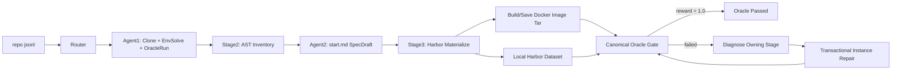
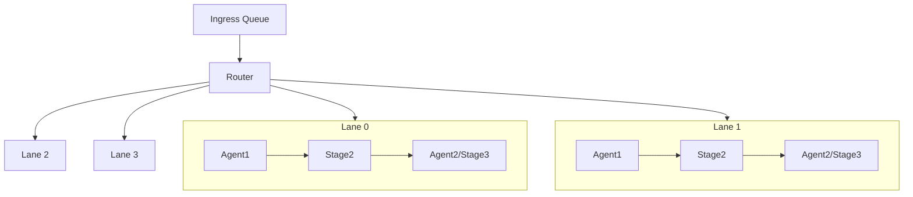

# TeamFactory 流程原理

TeamFactory 的目标是：输入一批 GitHub Python 仓库 URL，自动为每个仓库构造一个 Harbor 格式的 NL2Repo instance，并在远端物理机上保存对应 Docker image tar。

它和 NLFactory/NLFactory2/NLFactory3 解耦，当前代码只放在：

```text
/volume/pt-coder/users/kka/TeamFactory
```

## 总体流程



每个 URL 会被转换成一个 `task_id`，然后进入流水线。流水线不会提前把所有数据固定分配给某条 lane，而是根据当前 lane 的空闲状态动态分发。

## 输入

输入是一个 JSONL 文件，每行一个仓库：

```json
{"url": "https://github.com/owner/repo"}
```

常用输入例子：

```text
/volume/pt-coder/users/kka/repo_candidates/github_nl2repo_like_candidates_500.jsonl
```

## 并发模型

TeamFactory 使用两层并发：



- `tp`：lane 数量。
- `pp`：每条 lane 的流水线容量参数。当前实现中，单条 lane 的最大负载是 `pp + 1`。
- 同一条 lane 上，同一个 stage 同时最多跑一个 item。
- 同一条 lane 上，不同 stage 可以同时处理不同 item。
- `--agent1-concurrency` 控制全局 Agent1 并发。
- `--agent2-concurrency` 控制全局 Agent2 并发。
- Stage2 不调用模型，当前没有额外全局并发限制。

例如 `tp=4, pp=4` 时，最多有 4 条 lane，每条 lane 最多容纳 5 个 queued/active item。

## Stage 1: Agent1

代码位置：

```text
teamfactory/stages/agent1/stage.py
teamfactory/stages/agent1/prompt.md
```

Agent1 是模型阶段。它在远端物理机上启动 Claude Code，根据一个 repo URL 完成：

1. 在远端 task 目录下 clone 仓库。
2. 判断仓库是否有可用 Dockerfile。
3. 如果有，优先复用；如果没有，则创建适合该 Python 项目的 Dockerfile。
4. 在 Docker 中安装依赖。
5. 推断并运行项目自带测试，也就是 oracle test。
6. 输出结构化 `agent1.json`。

Agent1 的核心输出包括：

```text
docker.image
env_spec.install_commands
env_spec.test_commands
env_spec.package_files
env_spec.test_files
env_spec.fixture_files
oracle_report
```

Agent1 不负责写 `start.md`，也不负责生成 Harbor instance。

## Stage 2: AST Inventory

代码位置：

```text
teamfactory/stages/stage2_ast/stage.py
```

Stage2 是规则阶段，不调用模型。它读取 Agent1 的输出，并在 Docker 中扫描远端仓库源码，抽取：

- public classes
- public methods
- public functions
- signatures
- docstrings
- return hints
- raises
- calls
- project tree
- test case count
- parse errors

Stage2 输出两个本地产物：

```text
<work-dir>/items/<task_id>/stage2_ast.json
<work-dir>/items/<task_id>/stage2_ast_payload.json
```

其中 `stage2_ast_payload.json` 会作为 Agent2 写 `start.md` 的主要结构化证据之一。

## Stage 3: Agent2 + Harbor Materialize

代码位置：

```text
teamfactory/stages/agent2_stage3/stage.py
teamfactory/stages/agent2_stage3/prompt.md
```

这个阶段分成两步：

1. Agent2 调模型读取 repo、测试、README/docs、Stage2 AST 产物，生成远端：

```text
<remote_task_dir>/stage3/start.md
```

2. 规则 materializer 把远端仓库和 `start.md` 转成本地 Harbor 格式 instance，并构建最终 Docker image tar。

当前 Agent2 prompt 重点约束：

- `start.md` 必须贴近 NLFactory/NL2RepoBench 风格。
- Core API 中函数必须暴露 public signature、参数、返回、错误行为和非平凡例子。
- 类需要合并关键 public methods，并暴露变量和方法名，但不能复制实现体。
- Detailed nodes 必须使用：

```text
### Node N: <behavior name>
**Function Description**:
**Handling Strategy**:
**Input and Output Examples**:
```

- Node examples 必须写成 mini test-spec，给出具体输入、输出、状态变化、文件变化、CLI 输出或异常行为，而不是只写几句泛泛描述。

## 最终 Harbor 产物

本地 dataset 会写到：

```text
<dataset-root>/<task_id>/
```

默认常用位置：

```text
/volume/pt-coder/users/kka/harbor/datasets/TeamFactory/<task_id>/
```

目录结构：

```text
<task_id>/
├── environment/
│   ├── Dockerfile
│   └── start.md
├── instruction.md
├── solution/
│   ├── oracle/
│   └── solve.sh
├── task.toml
└── tests/
    ├── config.json
    ├── reference/
    └── test.sh
```

远端 image tar 会写到：

```text
<remote-image-root>/<task_id>.tar
```

常用位置：

```text
/shared/users/kka/TeamFactory_images/<task_id>.tar
```

## 评测逻辑

生成后的 Harbor instance 里，`tests/test.sh` 大致做这些事：

1. 读取 `tests/config.json`。
2. 在 `/workspace` 中清理将由 reference 覆盖的测试目录或测试文件。
3. 将 `tests/reference` 中的测试、fixture、必要 package 文件复制到 `/workspace`。
4. 如果测试命令里出现 `/testbed`，则建立 `/testbed -> /workspace` 的兼容链接。
5. 在 `/workspace` 下运行 Agent1 得到的 oracle test commands。
6. 写出 verifier 需要的 report 和 reward。

注意：这个测试逻辑使用的是原项目自带测试行为，不应该在 `start.md` 中泄漏 verifier 内部路径、隐藏测试或 exact assertion。

## 常用启动命令

```bash
cd /volume/pt-coder/users/kka/TeamFactory

TEAMFACTORY_API_KEY='YOUR_KEY' \
./scripts/run_teamfactory_agent1.sh \
  --repo-jsonl /volume/pt-coder/users/kka/repo_candidates/github_nl2repo_like_candidates_500.jsonl \
  --limit 16 \
  --tp 4 \
  --pp 4 \
  --concurrency 4 \
  --agent1-concurrency 4 \
  --agent2-concurrency 4 \
  --dataset-root /volume/pt-coder/users/kka/harbor/datasets/TeamFactory \
  --remote-work-root /tmp/kka_TeamFactory_smoke_stage3_tp4pp4 \
  --remote-image-root /shared/users/kka/TeamFactory_images \
  --agent1-model gpt-5.4-ppio \
  --agent2-model gpt-5.4-ppio \
  --oracle-repair-model claude-sonnet-4-6-ppio
```

## 常用状态检查

查看 checkpoint：

```bash
jq '{complete,pid,tp,pp,lane_capacity,counts,active,queued,error,updated_at}' \
  /volume/pt-coder/users/kka/TeamFactory/.runs_smoke_stage3_tp4pp4/*/checkpoint.json
```

查看本地 instance 数量：

```bash
find /volume/pt-coder/users/kka/harbor/datasets/TeamFactory \
  -mindepth 1 -maxdepth 1 -type d | wc -l
```

查看远端 image tar：

```bash
find /shared/users/kka/TeamFactory_images -maxdepth 1 -name '*.tar' -printf '%f\n'
```

## 关键原则

1. Agent1 只解决环境和 oracle，不写 instance spec。
2. Stage2 只做确定性 inventory，不调用模型。
3. Agent2 只负责把证据转成高质量 `start.md`。
4. Materializer 只负责 Harbor 格式落盘和 Docker image tar。
5. `start.md` 应该描述可重建行为契约，而不是复制源码或翻译测试文件。
6. Stage3 产物必须通过 canonical Harbor oracle 才算完成；失败项按
   `agent1`、`stage2_ast` 或 `agent2_stage3` 记录责任归属，修复只在事务式
   recheck 达到 `1.0` 后保留。

## Stage 4: Canonical Oracle Repair Gate

Stage3 成功物化 instance 后，scheduler 默认进入 `oracle_repair`：

1. 使用 Harbor 的 `oracle` agent 运行 `solution/solve.sh` 和 verifier。
2. reward 为 `1.0` 时记录 `oracle_passed`。
3. 否则收集 verifier report、日志和 instance 文件作为修复证据。
4. 修复 agent 标记责任阶段：
   - `agent1`：依赖、Python/runtime、系统包和基础镜像；
   - `stage2_ast`：测试发现、fixture/package inventory、测试数量；
   - `agent2_stage3`：Harbor 物化、canonical solution、reference 和 verifier。
5. 候选 instance 通过防测试弱化、防答案泄漏和镜像泄漏校验后，以事务方式
   替换 instance 和 image tar。
6. canonical recheck 达到 `1.0` 才提交，否则回滚并进入下一轮；超过
   `--oracle-max-repair-rounds` 后记录 `oracle_failed`。

该 gate 默认开启。仅在调试生成阶段时使用 `--skip-oracle-repair` 跳过。
